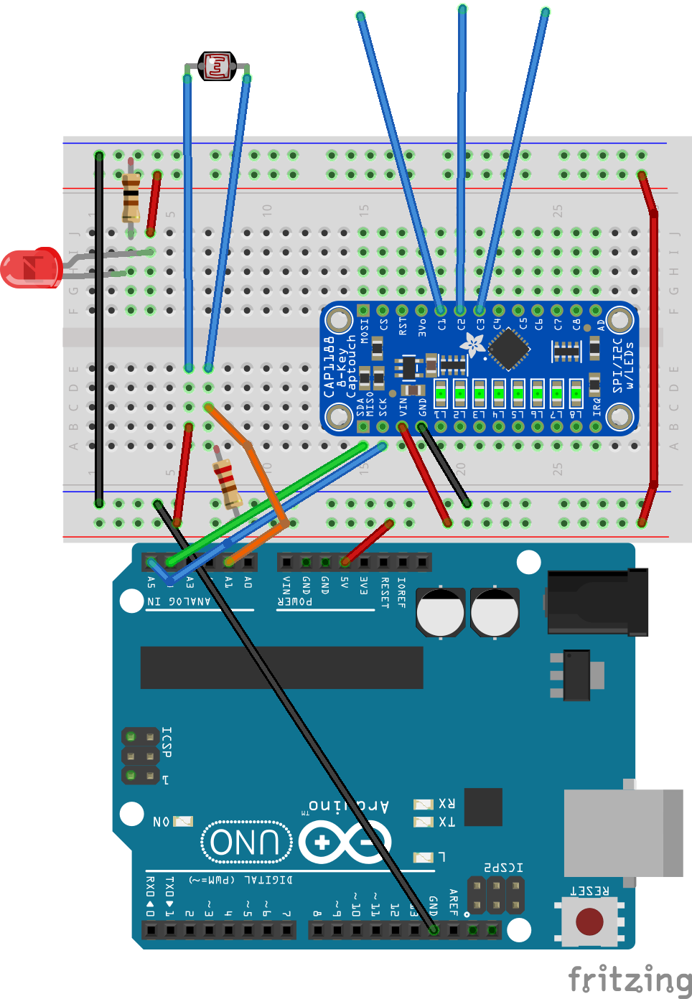

# Organic Theramin
 For Experinces and Interfaces 2025. 
 
 A fleshy singing creature, in installation form. 
 

_Organic Theremin_ is a narrative installation created for exhibition in Experience and Interfaces OCADU 2025. It explores curiosity in the monstrous, and how something that initially can seem quite frightening and monstrous can reward your curiosity with affection and beauty.

The installation features a solitary desk at the center of a vast room lit by a single table lamp. The desk is scattered with the accoutrements of an early 20th century naturalist, including his notes on a mysterious item he found. Spotlighted on the desk is a locked box emitting frightening noises, something is trapped inside and angry, possibly dangerous.  The thumping subsides as the box is opened to reveal an organic and alien creature nestled into the box, staring up at the interlocutor with one unblinking eye.

Someone brave enough to reach towards the creature will find their presence is in fact welcome - the creature sings out a single sustained note. Different areas of the creature’s body emit a different note, and when participants and the creature collaborate and all four notes are played together, the resulting chord is joined by a fifth playful melody - the creature is happy. No amount of harmonizing will satisfy him, though. If the box is closed again, he will quickly become restless and demand to be let out again. 
